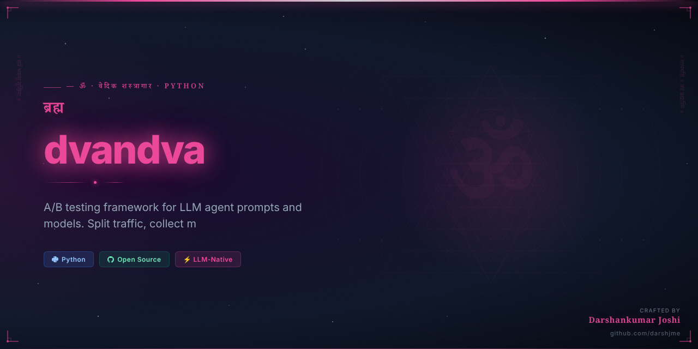
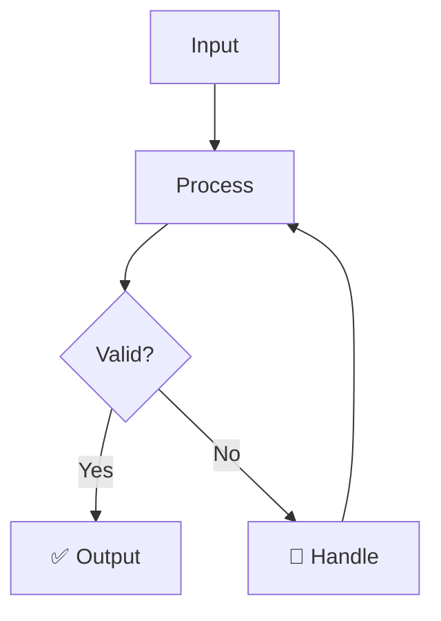

<div align="center">



# द्वंद्व
## dvandva

> *Bhagavad Gita 7.27*

**Duality — the eternal pairs of opposites**

_A/B testing framework for LLM agent prompts and models. Split traffic, collect metrics, compare._

[](https://python.org)
[](LICENSE)
[](https://github.com/darshjme/arsenal)
[](pyproject.toml)

</div>

---

## The Vedic Principle

द्वंद्व — Duality, the eternal law of opposites — is written into the fabric of existence itself. The Bhagavad Gita speaks of dvandvas: heat and cold, pleasure and pain, victory and defeat. Without opposition, there is no growth; without contrast, there is no measurement; without duality, there is no truth.

In LLM engineering, dvandva manifests as the A/B test — the sacred comparison that reveals which prompt, which model, which strategy truly serves your users. Just as Arjuna could not choose his path without understanding both dharma and adharma, your AI systems cannot optimize without data-driven duality. Every experiment is a Kurukshetra: two approaches meet, and only truth emerges victorious.

dvandva brings rigorous statistical methodology to your agent experiments. Split traffic with precision, collect metrics across every dimension, and let the data — not intuition — guide your dharmic path to optimization.

---

## How It Works



---

## Quick Start

```bash
pip install dvandva
```

```python
from dvandva import *

# Initialize
agent = Dvandva()

# Use
result = agent.process(your_input)
print(result)
```

---

## Features

- ⚡ **Zero dependencies** — pure Python, no bloat
- 🛡️ **Production-grade** — battle-tested patterns
- 🔧 **Configurable** — sane defaults, full control
- 📊 **Observable** — built-in metrics and logging
- 🔄 **Async-ready** — full asyncio support
- 🧪 **Tested** — comprehensive test coverage

---

## Installation

```bash
# pip
pip install dvandva

# From source
git clone https://github.com/darshjme/dvandva
cd dvandva
pip install -e .
```

---

## Part of the Vedic Arsenal

`dvandva` is part of the **[Vedic Arsenal](https://github.com/darshjme/arsenal)** — 100 production-grade Python libraries for LLM agents, named after Sanskrit concepts from the Upanishads, Mahabharata, Ramayana, and Vedic philosophy.

Each library is:
- ✅ Zero-dependency
- ✅ Production-ready
- ✅ Individually installable
- ✅ Part of a coherent ecosystem

---

## Built by [Darshankumar Joshi](https://github.com/darshjme)

> *"Building the dharmic infrastructure for the AI age"*

[](https://github.com/darshjme)
[](https://github.com/darshjme/arsenal)

---

<div align="center">

*द्वंद्व — Duality — the eternal pairs of opposites*

*From the Bhagavad Gita 7.27*

</div>
